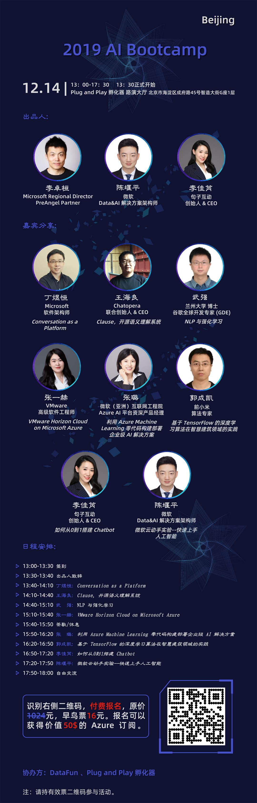
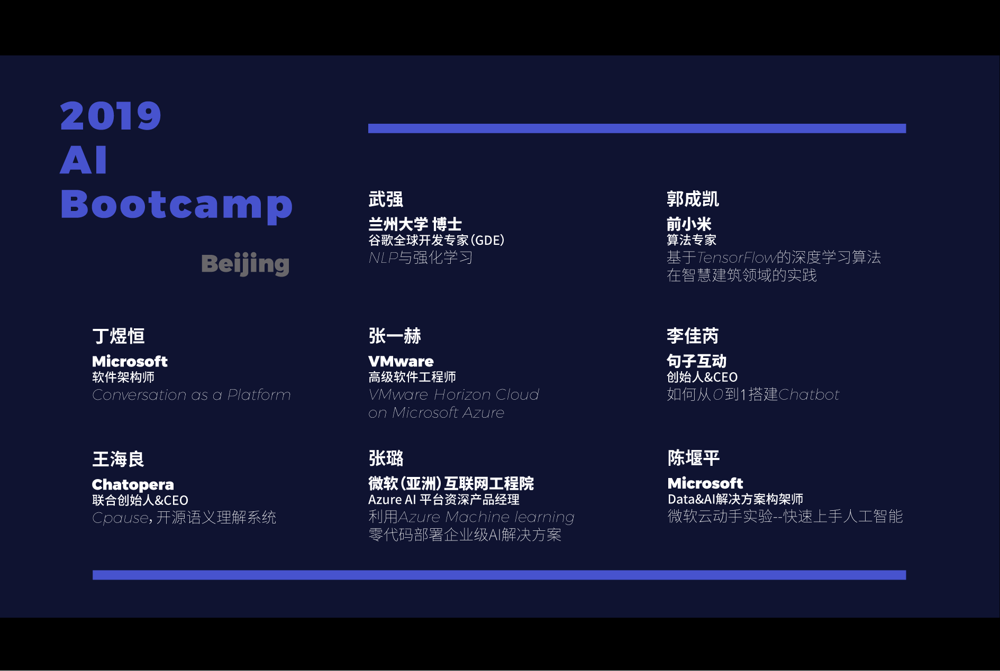
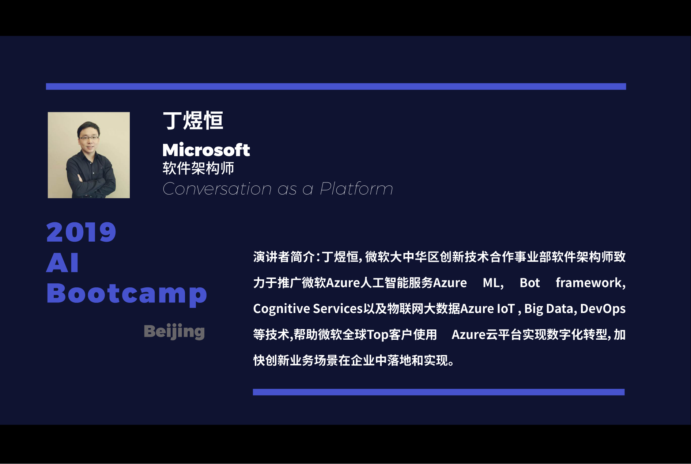
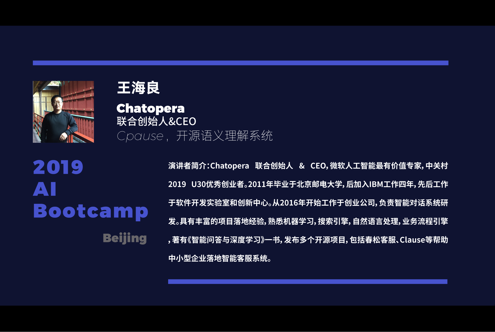
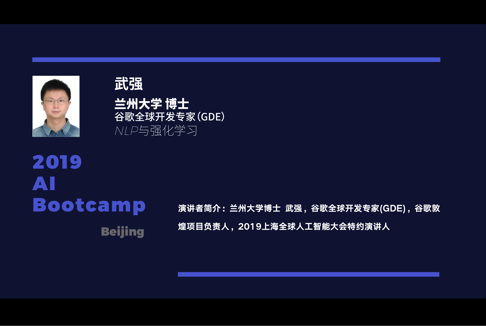
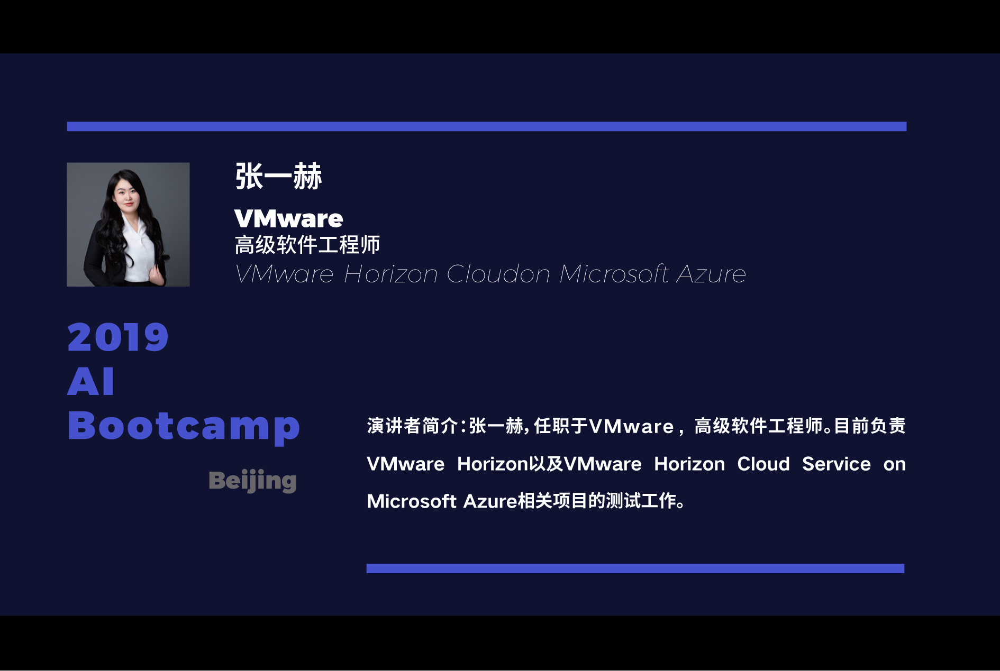
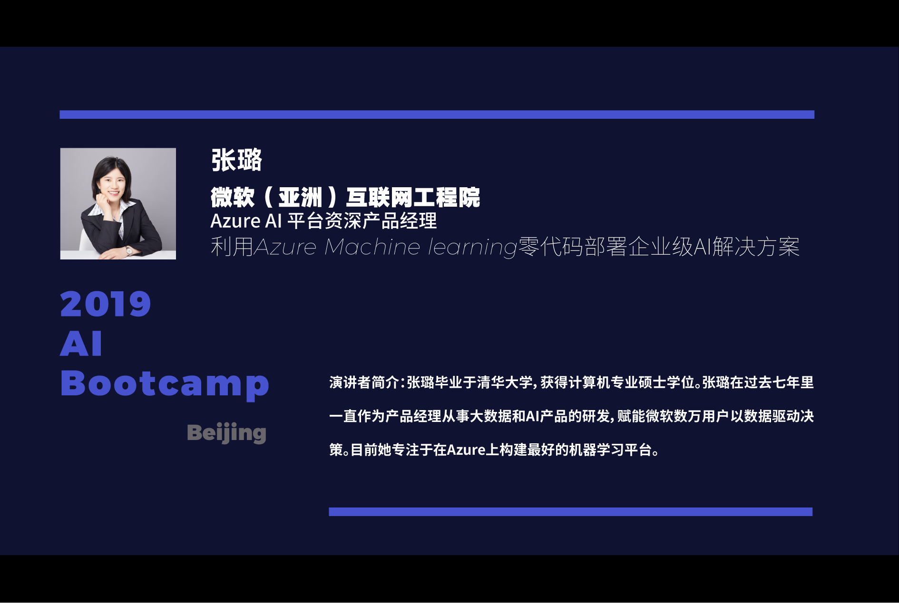
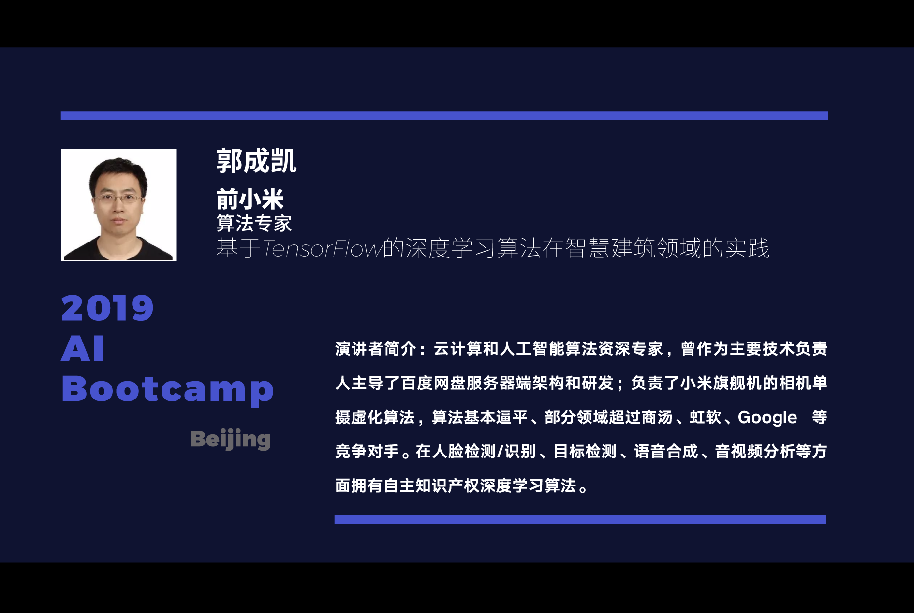
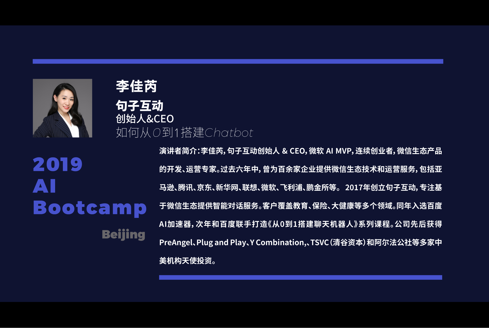
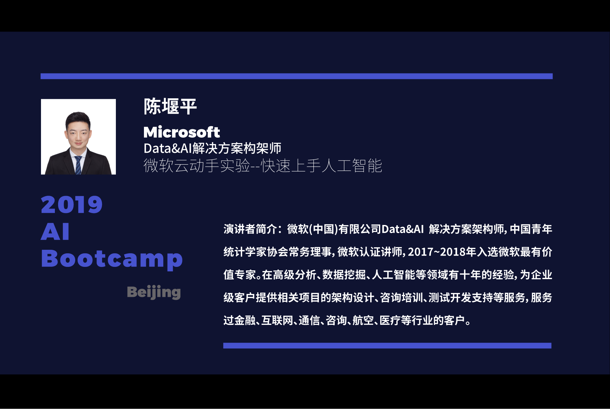

# microsoft-ai-bootscamp

Microsoft AI Bootscamp

1. [Global AI Bootcamp](https://globalai.community/)
1. [Global AI Bootcamp Beijing](https://globalai.community/global-ai-bootcamp/china-beijing)
1. [Global AI Bootcamp Beijing 活动行报名](http://www.huodongxing.com/event/7522661425200)

## 2019 AI Bootcamp Beijing

### Videos

- Live Broadcast Recording: Global AI Bootscamp 2019 - Beijing: <https://youtu.be/jKbMFxDw0T4>
- Speaker Talk Video Play List:
    - <https://www.youtube.com/playlist?list=PL8hd9KDTdarCWCwVZlF_c5swB_3cve5l2>
    - <https://www.bilibili.com/video/av80153181/>

#### [MVP & PNP Introduction](https://youtu.be/BflpNwE_UTk)

#### [Conversation as a Platform - 丁煜恒](https://youtu.be/agbfgHXB_fk)

#### [Clause，开源语义理解系统 - 王海良](https://youtu.be/oQwo7pyqVyw)

#### [NLP与强化学习 - 武强](https://youtu.be/YVa342GMpyo)

#### [VMware Horizon Cloud on Microsoft Azure - 张一赫](https://youtu.be/BbcHpkkqdfI)

#### [利用Azure Machine Learning零代码构建部署企业级AI解决方案 - 张璐](https://youtu.be/oUo6Bkw20NE)

#### [基于 TensorFlow 的深度学习算法在智慧建筑领域的实践 - 郭成凯](https://youtu.be/mapRY35Ye0s)

#### [如何从0到1搭建 Chatbot - 李佳芮](https://youtu.be/bdq8VNuHvVo)

#### [微软云动手实验--快速上手人工智能 - 陈堰平](https://youtu.be/QBAbOopjEcg)

### Organizers

1. [Huan](https://github.com/huan) [(李卓桓)](http://linkedin.com/in/zixia) Co-author of [Wechaty](https://github.com/wechaty/wechaty), PreAngel Partner <zixia@zixia.net>
1. Yanping CHEN (陈堰平), Data&AI Cloud Solution Architect of Microsoft, ex MVP
1. [Rui](https://github.com/lijiarui),[(李佳芮)](https://lijiarui.github.io) Co-author of [Wechaty](https://github.com/wechaty/wechaty), Founder of [JuziBot](https://www.botorange.com/)

### Special Thanks

1. Kris LIANG (梁迪), Community Manager of MVP Program, 现场人气支持
1. Curly (康康), Community Assistant of MVP Program, 现场签到
1. Dachuan WANG (王大川), Founder & CEO of DataFun, 活动策划支持
1. Fei HONG (洪飞), Operating Manager of DataFun, 活动策划支持
1. Ruoxin SONG (宋若芯), Artist Student, Central Academy Of Fine Arts, 视频后期剪辑
1. Qian LI (李乾), Community Manager of Juzi.BOT, 现场摄像支持
1. Yuan GAO (高原), CTO of Juzi.BOT, 现场技术支持
1. Rui LI (李锐), AI Product Manager of Microsoft, 演讲嘉宾邀请支持

## Resources

1. [MVP项目介绍](https://docs.google.com/presentation/d/1TDh6-IHCRPnesyLMTtXvi3thulLJXwhEdLeBdTNR6xU/edit?usp=sharing)
1. [微软开发者MSDN月刊订阅](https://docs.google.com/presentation/d/1Wc_u47WPa3Q2FEjkx2nN4GNM9TLFQG4AtoC3esU_QqI/edit?usp=sharing)
1. [Global AI Bootcamp Keynote](https://globalai.community/global-ai-bootcamp/information/keynote/) ([YouTube](https://www.youtube.com/watch?v=31SUgJM9YUI))
1. [Plug and Play China Headquaters Intro](https://docs.google.com/presentation/d/1H5iJj2OBkkvgimdC-V85Sc5NXoOEYLfgsxy2mQkIF3Y/edit?usp=sharing)

