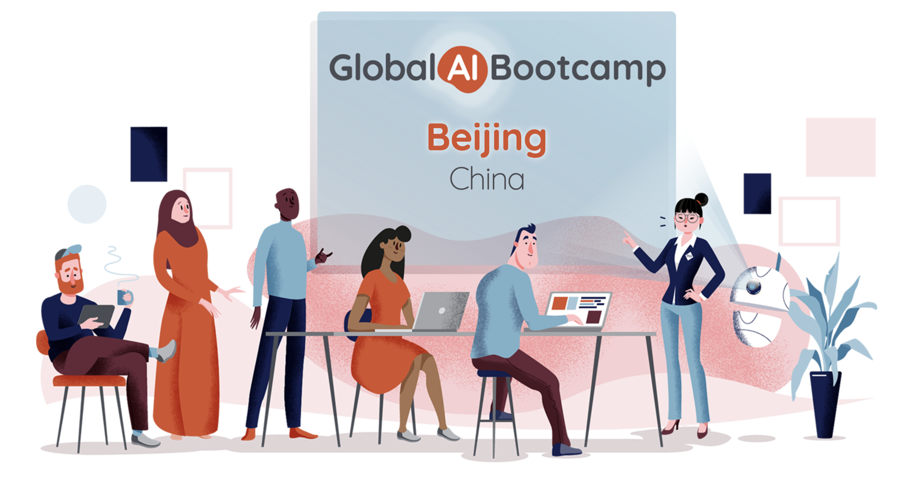
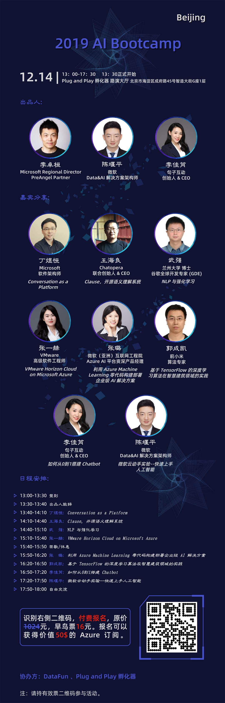

# microsoft-ai-bootscamp

Microsoft AI Bootscamp

1. [Global AI Bootcamp](https://globalai.community/)
1. [Global AI Bootcamp Beijing](https://globalai.community/global-ai-bootcamp/china-beijing)
1. [Global AI Bootcamp Beijing 活动行报名](http://www.huodongxing.com/event/7522661425200)

## 2019 AI Bootcamp Beijing

## Live Streaming

You can watch the live stream of the Global AI Bootscamp Beijing 2019 from [YouTube](https://youtu.be/jKbMFxDw0T4).

## Resources

1. [MVP项目介绍](https://docs.google.com/presentation/d/1TDh6-IHCRPnesyLMTtXvi3thulLJXwhEdLeBdTNR6xU/edit?usp=sharing)
1. [微软开发者MSDN月刊订阅](https://docs.google.com/presentation/d/1Wc_u47WPa3Q2FEjkx2nN4GNM9TLFQG4AtoC3esU_QqI/edit?usp=sharing)
1. [Global AI Bootcamp Keynote](https://globalai.community/global-ai-bootcamp/information/keynote/) ([YouTube](https://www.youtube.com/watch?v=31SUgJM9YUI))
1. [Plug and Play China Headquaters Intro](https://docs.google.com/presentation/d/1H5iJj2OBkkvgimdC-V85Sc5NXoOEYLfgsxy2mQkIF3Y/edit?usp=sharing)

## Organizers

- [Huan](https://github.com/huan) [(李卓桓)](http://linkedin.com/in/zixia) Co-author of [Wechaty](https://github.com/wechaty/wechaty), <zixia@zixia.net>
- Yanping CHEN (陈堰平), Microsoft AI MVP(ex)
- [Rui](https://github.com/lijiarui),[(李佳芮)](https://lijiarui.github.io) Co-author of [Wechaty](https://github.com/wechaty/wechaty), Founder of [JuziBot](https://www.botorange.com/)
